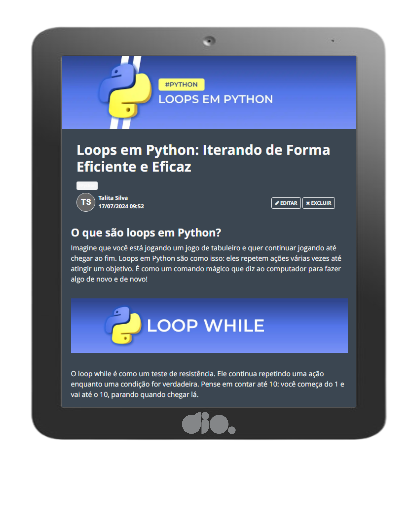

    

  
  

-------

  

# Projeto artigo técnico gerado por I.A.s

Projeto com o objetivo de gerar um artigo técnico com um layout rico, leitura agradável e com foco em promover sua autoridade técnica.

<a href="https://www.dio.me/articles/loops-em-python-iterando-de-forma-eficiente-e-eficaz" title="View article now"> 📕Clique aqui para ler o artigo</a>

## 💻 Tecnologias utilizadas no projeto

- [ChatGPT](https://chat.openai.com/) - para título e conteúdo
- [PowerPoint](https://www.microsoft.com/en/microsoft-365/powerpoint) - Para formatação de banners e Layouts

## 📄 Prompts e ferramentas

ChatGPT：

|   Ação   | prompt                                                                                                                                                                                                                                                                         |
| :------: | ------------------------------------------------------------------------------------------------------------------------------------------------------------------------------------------------------------------------------------------------------------------------------ |
|  título  | Crie 10 headlines para nomes de artigos sobre o assunto Python - Estrutura de controle                                                                                                                                                                                                    |
| conteúdo | Comporte-se como um escritor de artigos tech backend e escreva o artigo atendendo as regras abaixo {REGRAS} > no máximo 5 linhas por blocos de explicação > me explique de maneira informal como se eu fosse uma criança de 10 anos > os blocos que serão criados estão abaixo: - o que são loops em Python - explique o loop while 	- cite exemplos com código - explique o loop for 	- cite exemplos com código  |

## ✨ Features

- Conteúdo gerado via ChatGPT

## 📚 Materiais

- prompts utilizados

## 🛠️ Instruções de execução

Utilize os prompts acima nas ferramentas sugeridas para gerar o material base e utilize uma ferramenta de edição de documentos como power point, libreoffice , indesign para diagramação, o passo a passo em vídeo pode ser conferido na plataforma da [DIO](https://dio.me).

⌨️ com 💜 por [Talita Dias](https://github.com/talitasdias)
